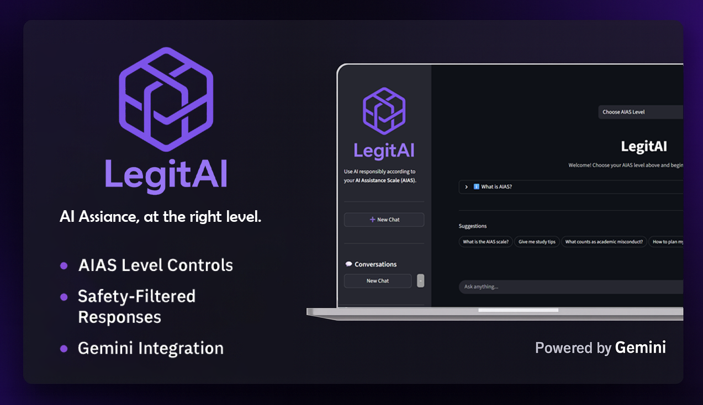

✨ **LegitAI - AI Assistance, at the right level.**
==================================================

_A controlled, safe, and compliance-aware AI assistant powered by Google Gemini._



Overview
-----------

**LegitAI** is a safety-aware AI assistant designed to provide **controlled AI help based on the allowed level of assistance**. It enforces the **AI Assistance Scale (AIAS)** - a multi-level permission system - ensuring users receive AI help that complies with academic or organizational policies.

Built using **Gemini 2.0 Flash**, LegitAI combines structured reasoning, safe output filtering, and dynamic guardrails to deliver **AI at exactly the right level**.


🎯 Problem
----------

Unrestricted AI tools create real risks:

*   ❗ Students accidentally violating academic integrity
*   ❗ Universities lacking compliant AI tools
*   ❗ No standard for limiting AI assistance
*   ❗ AI hallucinations producing unsafe/inaccurate answers
    

**LegitAI solves these problems** by enforcing strict rules on what the AI is allowed to do at each level — and automatically blocking or adjusting responses.


💡 Solution
-----------

LegitAI introduces a **controlled AI assistance gateway**, where the user selects their allowed AIAS level (1–5), and the AI must remain within those boundaries.

It uses:

*   **Gemini’s structured JSON schema**
*   **A custom compliance engine**
*   **Safety violation detection**
*   **Context-aware suggestions**
*   **Locked levels per-chat for integrity**
    
This ensures every response is **aligned, compliant, and safe**.


📌 Key Features
===============

### 🔐 **AIAS Level Selector (Levels 1–5)**

Controls how much help the AI can provide:

| Level | Description                        |
| ----- | ---------------------------------- |
| **1** | No AI assistance / conceptual only |
| **2** | High-level planning / ideas        |
| **3** | Improve existing user work         |
| **4** | Detailed guidance with reasoning   |
| **5** | Full AI exploration / creation     |


### 🛡️ **Safety & Compliance Engine**

Every Gemini output is validated through:

*   violation detection
*   structured JSON schema
*   level-based permission rules
*   warnings injected if the model oversteps
    

### 📤 **Export Chat Transcripts**

Users can export full chat logs for:

*   academic submission    
*   auditing
*   review


### ⚡ **Streamlit Frontend**

Fast, reactive, clean UX:

*   Multi-chat system
*   Sidebar with chat sessions
*   Live streaming responses
*   Locked AIAS level after first message
    

🏗️ Architecture
================
```
┌───────────────────────────┐
│     Streamlit Frontend    │
│  - Multi-chat sessions    │
│  - Suggestions UI         │
│  - Level selector (AIAS)  │
└──────────────┬────────────┘
               │
               ▼
┌───────────────────────────┐
│     Backend Engine        │
│  - Level enforcement      │
│  - Violation detection    │
│  - Prompt construction    │
│  - Structured parsing     │
└──────────────┬────────────┘
               │
               ▼
┌───────────────────────────┐
│      Gemini 2.0 Flash     │
│  - Multimodal reasoning   │
│  - JSON schema outputs    │
└───────────────────────────┘

```

🧰 Tech Stack
=============

| Layer       | Technology                        |
| ----------- | --------------------------------- |
| Frontend    | **Streamlit**                     |
| Backend     | **Python**                        |
| AI Model    | **Gemini 2.0 Flash (Google)**     |
| Data Schema | **Pydantic**                      |
| Environment | **dotenv**                        |
| UI          | Custom CSS + Streamlit Components |


🔄 How It Works - Step by Step
==============================

1.  User starts a new chat and selects an **AIAS Level**
2.  User sends a message or clicks a suggestion
3.  Request sent to backend:
    *   level enforcement
    *   schema validation
    *   history packaging
4.  Backend sends structured prompt to **Gemini 2.0**
5.  Gemini returns JSON (reply + safety flags)
6.  LegitAI blocks or adjusts reply if:
    *   level violated
    *   unsafe content detected
7.  Final response streams back to user
8.  User can export chat transcript anytime
    


📦 Installation
===============

### **1\. Clone the repository**
```bash
git clone https://github.com/iqad311/LegitAI.git
cd LegitAI
```

### **2\. Install dependencies**
```
pip install -r requirements.txt
```

### **3\. Add your Gemini API key**

Edit the .env file:
```
GEMINI_API_KEY=your_key_here
```


### **4\. Run the app**
```
streamlit run app.py
```


⭐ Why LegitAI Is the Next Big Thing
===================================

*   Solves **real academic compliance problems**
*   Built on **advanced Gemini reasoning**
*   High demand for **controlled AI tools** in universities
*   Extensible to **enterprise AI governance**
*   Bridges the gap between **AI power** and **policy control**
*   Provides **transparent, auditable** assistance
    

This is not “just another chatbot.”It’s the **future of safe, policy-aligned AI usage.**


📈 Upcoming Features
====================

*   🧑‍🏫 Faculty dashboard
*   🗂️ Institution-wide policy engine
*   📄 Assignment-based locks
*   🖼️ Multimodal input support (images/files)
*   📊 Usage analytics & monitoring
*   🔒 Admin-level override tools
    


🙌 Acknowledgements
===================

Huge thanks to:

* [**Google DeepMind** (Gemini API)](https://deepmind.google/)
* [**Streamlit**](https://streamlit.io/)
* [**lablab.ai Hackathon Community**](https://lablab.ai/event/ai-genesis)
